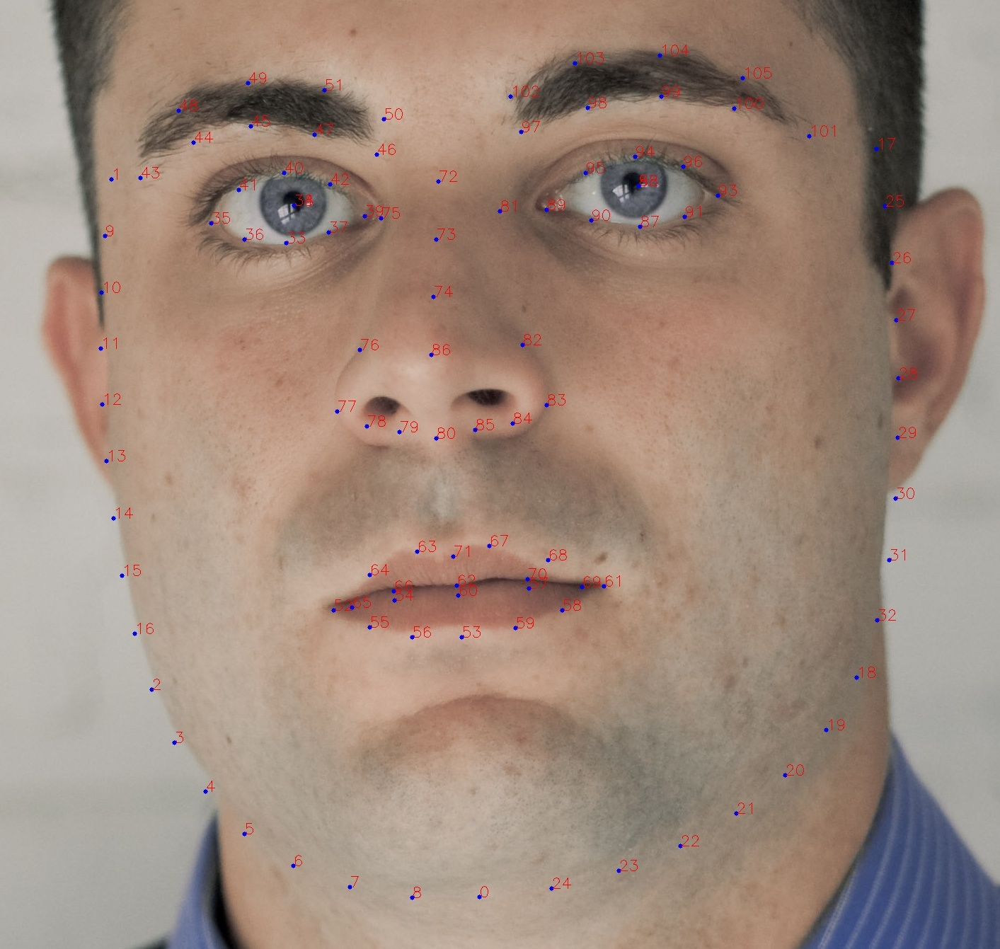

- 106人脸关键点检测
- 数据集见 [https://github.com/JACKYLUO1991/106-landmarks-dataset](https://github.com/JACKYLUO1991/106-landmarks-dataset)

- 106点标注规则 
- bbox_landmark.txt 每一行为 img_name, x1, y1, x2,  y2, 106点坐标

